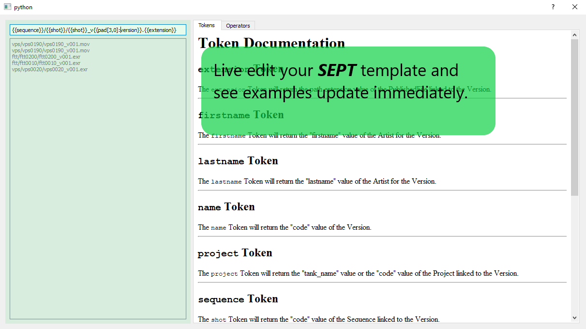
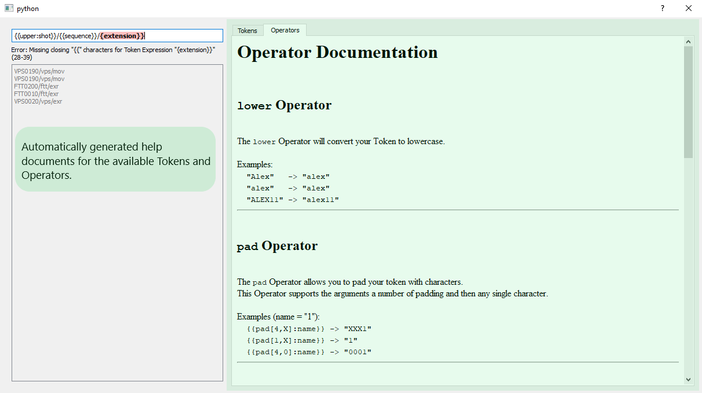

.. _non-developer-introduction:
===============================
User Quick Start
===============================

Introduction
==============

This ``Quick Start`` guide tries to demonstrate

- How to get started modifying your own ``SEPT`` templates
- Why you should care and flexibility you can gain from using ``SEPT``

Installation
==================

Users can easily install ``SEPT`` according to the following steps:

- Installing ``SEPT`` from the python packaging index is as simple as executing the following command:

    .. code-block:: python

        pip install sept

Getting Started
===============
This tutorial is aimed at someone that is not a developer and instead will be a user of some program that a developer writes that takes advantage of ``SEPT``

For this tutorial, we are going to learn how to write ``SEPT`` templates using the simple application that was created from the :ref:`developer-introduction-sample-qt-application<Developer Sample Application>` tutorial.

The finished product from that tutorial will look similar to the following:

.. image:: ../images/developer_introduction_sample_qt_application_finished.gif
   :width: 600
   :alt: Finished Qt Application from the Sample Qt Application Developer Tutorial

This application is a program that will prepare several "Version" entities from your internal `Shotgun <https://shotgunsoftware.com>`_ website. If you haven't worked with Shotgun before, don't worry. You should be able to substitute Shotgun for any production tracking software, and a "Version" entity for any rendered image sequence that can is approved to send back to the movie studio.

There are 2 main components to this application.

On the left side of the dialog you can see the editor window where we can test our ``SEPT`` template.

On the right side is the help window that shows all of the ``Token`` and ``Operator`` keywords that you have access to.

Interactive Tutorial
--------------------
We have an interactive

Template Examples
-----------------
We are going to gradually work up to a complex folder template but for now we are going to focus just on the filename that we want to create and ignore any folders.

------------

For our first example let's assume that we need to create a filename that no longer has the project code.
If
